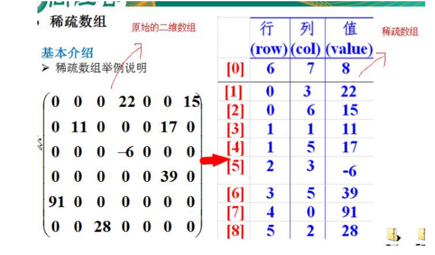
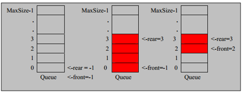
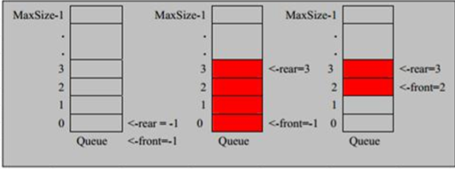
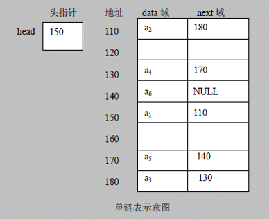
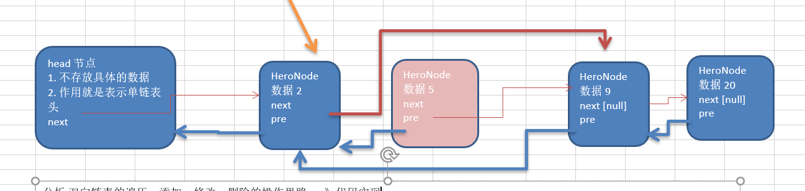
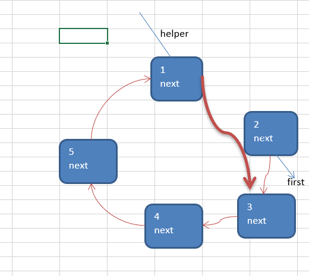
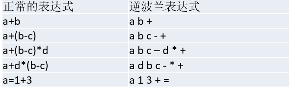

# 稀疏矩阵

## 二维数组转稀疏数组的思路
1. 遍历原始二维数组，得到有效的数据的个数
2. 根据sum就可以创建稀疏数组
3. 将二维数组的有效数据存入稀疏数组

## 稀疏数组转二维数组
1. 读取第一行，创建二维数组
2. 再读取后几行，填入数据 

# 队列
## 直队列
 - 队列是一个有序列表，可以用数组或是链表来实现。
 - 遵循先入先出的原则。即：先存入队列的数据，要先取出。后存入的要后取出
 - 示意图：(使用数组模拟队列示意图)
   
 
 ### 模拟
 1. 队列本身是有序列表，若使用数组的结构来存储队列的数据，则队列数组的声明如下图, 其中 maxSize 是该队列的最大容量。
 
 2. 因为队列的输出、输入是分别从前后端来处理，因此需要两个变量 front及 rear分别记录队列前后端的下标，front 会随着数据输出而改变，而 rear则是随着数据输入而改变
 3. 当我们将数据存入队列时称为”addQueue”，addQueue 的处理需要有两个步骤：
    **思路分析**: 
    - 将尾指针往后移：rear+1 , 当front == rear 【空】
    - 若尾指针 rear 小于队列的最大下标 maxSize-1，则将数据存入 rear所指的数组元素中，否则无法存入数据。 rear  == maxSize - 1[队列满]

 ### menu
 - 出队列操作getQueue
 - 显示队列的情况showQueue
 - 查看队列头元素headQueue
 - 退出系统exit
## 循环列表
 - 尾索引的下一个为头索引时表示队列满，即将队列容量空出一个作为约定,这个在做判断队列满的时候需要注意 (rear + 1) % maxSize == front 满] 
 - rear == front [空]
 - 测试示意图:
 

# 链表
 - 链表是以节点的方式来存储,是链式存储
 - 每个节点包含 data 域， next 域：指向下一个节点.
 - 如图：发现链表的各个节点不一定是连续存储.
 - 链表分带头节点的链表和没有头节点的链表，根据实际的需求来确定
 
 
## 模拟
 1. 创建
 2. 添加元素
 3. 按顺序添加
 4. 删除
 5. 修改

## moron面试题
 1. 求单链表中有效节点的个数
 2. 查找单链表中的倒数第k个结点 【新浪面试题】
   **思路**
   倒数第k个节点为 正数 size - k个节点
 3. 单链表的反转【腾讯面试题，有点难度】
   **思路**: 
     1. 先定义一个节点 reverseHead = new HeroNode();
     2. 从头到尾遍历原来的链表，每遍历一个节点，就将其取出，并放在新的链表reverseHead 的最前端.
     3. 原来的链表的head.next = reverseHead.next
     4. 类似头插法

 4. 从尾到头打印单链表 【百度，要求方式1：反向遍历 。 方式2：Stack栈】
   **思路**
   使用stack集合存放node
   出栈输出
 5. 合并两个有序的单链表，合并之后的链表依然有序【课后练习.】
 
 ## 双向链表
 管理单向链表的缺点分析: 
 - 单向链表，查找的方向只能是一个方向，而双向链表可以向前或者向后查找。
 - 单向链表不能自我删除，需要靠辅助节点 ，而双向链表，则可以自我删除，所以前面我们单链表删除时节点，总是找到temp,temp是待删除节点的前一个节点(认真体会).
 - 示意图帮助理解删除 
 
 ### 模拟
 双向链表的遍历，添加，修改，删除的操作思路
 1. 遍历 方和 单链表一样，只是可以向前，也可以向后查找
 2. 添加 (默认添加到双向链表的最后)
    - 先找到双向链表的最后这个节点
    - temp.next = newHeroNode
    - newHeroNode.pre = temp;
 3. 修改 思路和 原来的单向链表一样.
 4. 删除
    - 因为是双向链表，因此，我们可以实现自我删除某个节点
    - 直接找到要删除的这个节点，比如temp
    - temp.pre.next = temp.next
    - temp.next.pre = temp.pre;
  ## 循环链表
   ### 模拟
   - 构建一个单向的环形链表思路
     - 先创建第一个节点, 让 first 指向该节点，并形成环形
     - 后面当我们每创建一个新的节点，就把该节点，加入到已有的环形链表中即可.
   
   - 遍历环形链表
     - 先让一个辅助指针(变量) curBoy，指向first节点
     - 然后通过一个while循环遍历 该环形链表即可 curBoy.next  == first 结束

   ### 约瑟夫问题
    Josephu  问题为：设编号为1，2，… n的n个人围坐一圈，约定编号为k（1<=k<=n）的人从1开始报数，数到m 的那个人出列，它的下一位又从1开始报数，数到m的那个人又出列，依次类推，直到所有人出列为止，由此产生一个出队编号的序列。
    n = 5 , 即有5个人 
    k = 1, 从第一个人开始报数
    m = 2, 数2下
   
   思路
   1.  需求创建一个辅助指针(变量) helper , 事先应该指向环形链表的最后这个节点.
   补充： 小孩报数前，先让 first 和  helper 移动 k - 1次
   2.  当小孩报数时，让first 和 helper 指针同时 的移动  m  - 1 次
   3.  这时就可以将first 指向的小孩节点 出圈
   first = first .next 
   helper.next = first  
   原来first 指向的节点就没有任何引用，就会被回收
   
   出圈的顺序
   2->4->1->5->3
   
   
   
# 栈
## 模拟
 - 栈的英文为(stack)
 - 栈是一个先入后出(FILO-First In Last Out)的有序列表。
 - 栈(stack)是限制线性表中元素的插入和删除只能在线性表的同一端进行的一种特殊线性表。允许插入和删除的一端，为变化的一端，称为栈顶(Top)，另一端为固定的一端，称为栈底(Bottom)。
 - 根据栈的定义可知，最先放入栈中元素在栈底，最后放入的元素在栈顶，而删除元素刚好相反，最后放入的元素最先删除，最先放入的元素最后删除
 
## 应用场景
 - 子程序的调用：在跳往子程序前，会先将下个指令的地址存到堆栈中，直到子程序执行完后再将地址取出，以回到原来的程序中。 	
 - 处理递归调用：和子程序的调用类似，只是除了储存下一个指令的地址外，也将参数、区域变量等数据存入堆栈中。
 - 表达式的转换[中缀表达式转后缀表达式]与求值(实际解决)。
 - 二叉树的遍历。
 - 图形的深度优先(depth一first)搜索法
 
 ## 栈实现计算器
  使用栈完成表达式的计算 思路
1. 通过一个 index  值（索引），来遍历我们的表达式
2. 如果我们发现是一个数字, 将数字存入realNum字符串中，判断下一个是否是操作符：
    1. 是操作符则将realNum转为数字后入数栈
    2. 不是操作符则继续循环
3. 如果发现扫描到是一个符号,  就分如下情况
   1. 如果发现当前的符号栈为 空，就直接入栈
   2. 如果符号栈有操作符，就进行比较,如果当前的操作符的优先级小于或者等于栈中的操作符， 就需要从数栈中pop出两个数,在从符号栈中pop出一个符号，进行运算，将得到结果，入数栈，然后将当前的操作符入符号栈， 如果当前的操作符的优先级大于栈中的操作符， 就直接入符号栈.
4. 当表达式扫描完毕，就顺序的从 数栈和符号栈中pop出相应的数和符号，并运行.
5. 最后在数栈只有一个数字，就是表达式的结果

## 前缀表达式
   前缀表达式又称波兰式，前缀表达式的运算符位于操作数之前
   > (3+4)×5-6 对应的前缀表达式就是 - × + 3 4 5 6
   
   从右至左扫描表达式，遇到数字时，将数字压入堆栈，遇到运算符时，弹出栈顶的两个数，用运算符对它们做相应的计算（栈顶元素 和 次顶元素），并将结果入栈；重复上述过程直到表达式最左端，最后运算得出的值即为表达式的结果
   
 例如: (3+4)×5-6 对应的前缀表达式就是 - × + 3 4 5 6 , 针对前缀表达式求值步骤如下:
 
 1. 从右至左扫描，将6、5、4、3压入堆栈
 2. 遇到+运算符，因此弹出3和4（3为栈顶元素，4为次顶元素），计算出3+4的值，得7，再将7入栈
 3. 接下来是×运算符，因此弹出7和5，计算出7×5=35，将35入栈
 4. 最后是-运算符，计算出35-6的值，即29，由此得出最终结果
 

## 中缀表达式
中缀表达式就是常见的运算表达式，如(3+4)×5-6
中缀表达式的求值是我们人最熟悉的，但是对计算机来说却不好操作(前面我们讲的案例就能看的这个问题)，因此，在计算结果时，往往会将中缀表达式转成其它表达式来操作(一般转成后缀表达式.)

## 后缀表达式
后缀表达式又称逆波兰表达式,与前缀表达式相似，只是运算符位于操作数之后

从左至右扫描表达式，遇到数字时，将数字压入堆栈，遇到运算符时，弹出栈顶的两个数，用运算符对它们做相应的计算（次顶元素 和 栈顶元素），并将结果入栈；重复上述过程直到表达式最右端，最后运算得出的值即为表达式的结果

例如: (3+4)×5-6 对应的后缀表达式就是 3 4 + 5 × 6 - , 针对后缀表达式求值步骤如下:

1. 从左至右扫描，将3和4压入堆栈；
2. 遇到+运算符，因此弹出4和3（4为栈顶元素，3为次顶元素），计算出3+4的值，得7，再将7入栈；
3. 将5入栈；
4. 接下来是×运算符，因此弹出5和7，计算出7×5=35，将35入栈；
5. 将6入栈；
6. 最后是-运算符，计算出35-6的值，即29，由此得出最终结果	

### 后缀表达式

1. 初始化两个栈：运算符栈s1和储存中间结果的栈s2；
2. 从左至右扫描中缀表达式；
3. 遇到操作数时，将其压s2；
4. 遇到运算符时，比较其与s1栈顶运算符的优先级：
   1. 如果s1为空，或栈顶运算符为左括号“(”，则直接将此运算符入栈；
   2. 否则，若优先级比栈顶运算符的高，也将运算符压入s1；
   3. 否则，将s1栈顶的运算符弹出并压入到s2中，再次转到(4.1)与s1中新的栈顶运算符相比较；
5. 遇到括号时：
    1. 如果是左括号“(”，则直接压入s1
    2. 如果是右括号“)”，则依次弹出s1栈顶的运算符，并压入s2，直到遇到左括号为止，此时将这一对括号丢弃
6. 重复步骤2至5，直到表达式的最右边
7. 将s1中剩余的运算符依次弹出并压入s2
8. 依次弹出s2中的元素并输出，结果的逆序即为中缀表达式对应的后缀表达式

